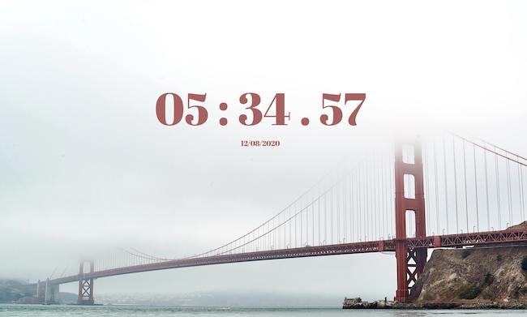

# Clock
Clock built with Javascript, Html, and CSS
This is a basic clock showing the current time based on your location, as well as the current date. 

# Preview:

DEMO [Demo] (https://blonded.github.io/Clock)

## Built with
- HTML
- CSS
- Javascript

## Author
Lena Blonded [Github](http://www.github.com/Blonded)

## Background image by:
Valentino [Unsplash](https://unsplash.com/@iampatrickpilz)
